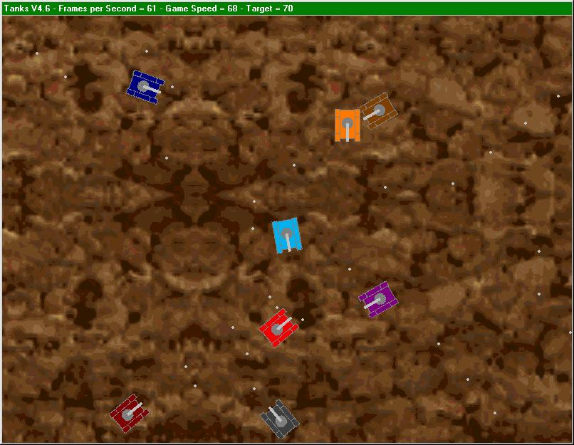



## Tanks V4\.6

### Description

A newer version of my Tanks Game which features 8 tanks (2 can by human controlled) shooting at each other. New features include a completely new speed handling system. No longer are there loads of timers, now almost everything comes from 1 main sub. Also moving the tanks and drawing them can now be done at different speeds. This allows the game to run the same speed even if something else on your computer happens or there are lots of shells on the screen. It simply decreases the number of frames per second however the moveing is all still odone at the same speed. Works perfecty from a K6-2 to a Athlon 800 (all the compuers i have tested it on). Please vote and i welcome comments.
 
### More Info
 

             |
---                |---
**Submitted On**   |2001-02-10 14:01:54
**By**             |[Nick Thompson](https://github.com/Planet-Source-Code/PSCIndex/blob/master/ByAuthor/nick-thompson.md)
**Level**          |Intermediate
**User Rating**    |4.9 (34 globes from 7 users)
**Compatibility**  |VB 5\.0
**Category**       |[Games](https://github.com/Planet-Source-Code/PSCIndex/blob/master/ByCategory/games__1-38.md)
**World**          |[Visual Basic](https://github.com/Planet-Source-Code/PSCIndex/blob/master/ByWorld/visual-basic.md)
**Archive File**   |[CODE\_UPLOAD147682102001\.zip](https://github.com/Planet-Source-Code/nick-thompson-tanks-v4-6__1-15180/archive/master.zip)

